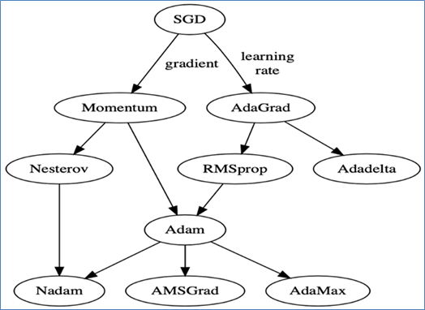
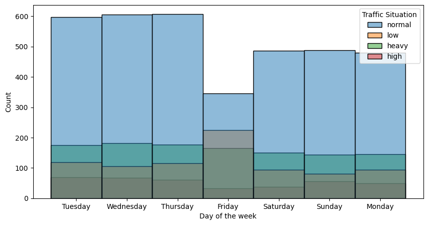
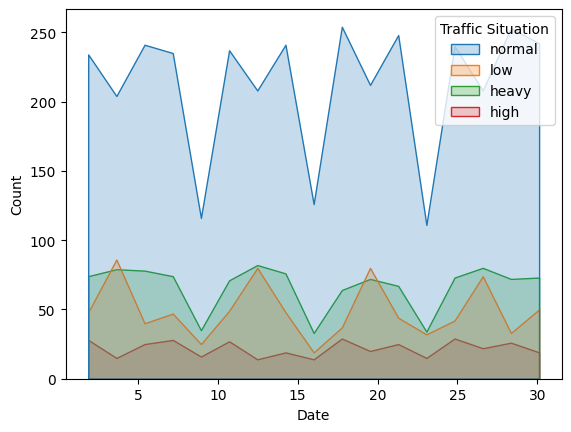
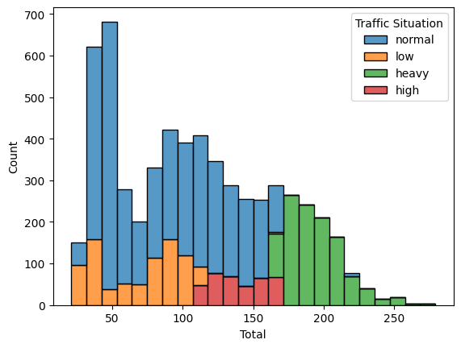
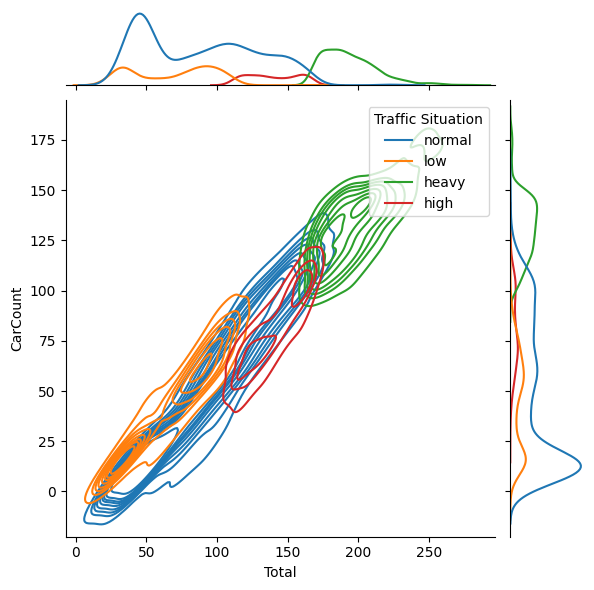
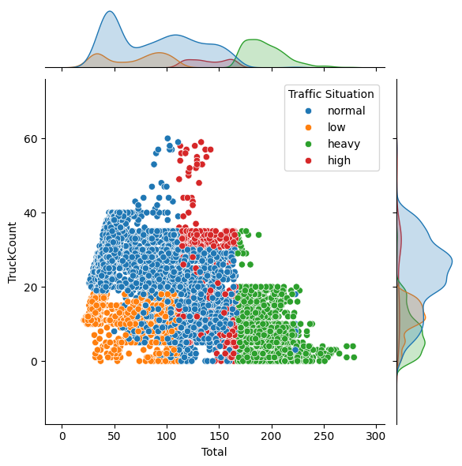
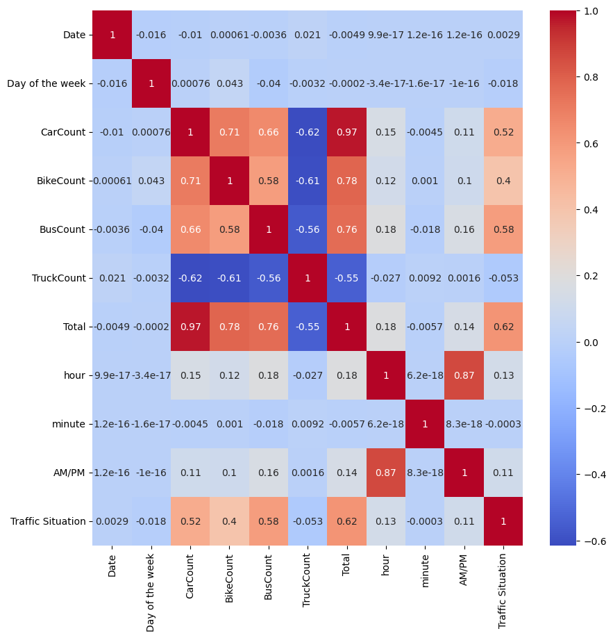

# DỰ ÁN CUỐI KỲ NHẬP MÔN MACHINE LEARNING
## Phần 1: Phần tìm hiểu cá nhân
### 1.1 Tìm hiểu, so sánh về các Optmizers

Trong machine learning hay cụ thể hơn là deep learning, nhiệm vụ của các optimizer hay optimizer algorithms (các thuật toán tối ưu) là những thuật toán giúp điều chỉnh các parameters (weights, biases, learning rates, ...) của model trong suốt quá trình training để làm sao giải thiểu được loss function. Những optimizers thường lặp đi lặp lại việc cập nhật các weights và biases.

Các optimizers có mục tiêu chung là phải giúp cho việc training càng nhanh càng tốt và cho ra các parameters sao cho dự đoán kết quả chính xác.
Một trong những vấn đề trong việc lựa chọn các optimizers là làm thế nào để có thể chọn đúng optimizer cho vấn đề hay ứng dụng cho việc gì đó? Vì trong thực trong tế, bộ dữ liệu có thể chứa hàng triệu features, hàng triệu instances, chỉ với một lần lặp để cập nhật các parameters cũng đã tốn một khoảng thời gian đáng kể.

Vì để tránh việc các áp dụng các optimizers không hiệu quả, sau đây tôi xin trình bày về những hiểu biết về các optimizers mà tôi tìm hiểu được, như Gradient Descent, Stochastic Gradient Descent, Stochastic Gradient descent with momentum, Mini-Batch Gradient Descent, Adagrad, RMSProp, AdaDelta, và Adam. Và tiếp theo đó là những so sánh các optimizers nhằm phần nào lựu chọn được optimizer phù hợp cho vấn đề của mình.

Những thành phần chung và quan trọng đối với một optimizer:
- Epoch: Số lần lặp mà thuật toán chạy với toàn bộ training dataset.
- Sample: Từng hàng trong một dataset.
- Batch: Biểu thị số lượng samples được lấy cho mỗi lần cập nhật các parameters của model.
- Learning rate: một parameter cung cấp cho model một scale (có thể hiểu là bước nhảy) dành cho việc cập nhật weights và biases.
- Cost Function/ Loss Function: hàm thể hiện độ sai lệch giữa giá trị dự đoán và giá trị thật sự.
- Weights và biases: các parameters của model, các parameters này sẽ liên tục được cập nhật, để cuối cùng có thể giúp model dự đoán chính xác.

#### _1.1.1 Gradient Descent_
Gradient Descent hay Batch Gradient Descent là một trong những optimizer cơ bản nhất. Nó được áp dụng cho cả hai vấn đề là regression và classification. Ngoài ra, cả Backpropagation trong neural network có sử dụng Gradient Descent.
Gradient Descent chủ yếu là đạo hàm từng phần các parameters gồm weights và bias trong loss function và sau đó cập nhật các parameters này sao cho loss function có giá trị nhỏ nhất (đạo hàm từng phần của loss function tiến tới giá trị là 0).

$$
\begin{align*} 
\text{R}&\text{epeat until convergence } \{ \\
& θ_{t+1}=θ_t-η∇_θ J(θ_t ) \\
\}
\end{align*}
$$

Trong đó:
$$
\begin{align*}
&\theta &\text{ tâp hợp các parameters (weights và bias)} \\
&J(\theta) &\text{ loss function} \\
&\nabla_{\theta}J(\theta_{t}) &\text{ đạo hàm của loss function tại một } \theta \text{ bất kì} \\
&\eta &\text{ learning rate, gia tốc tìm global minimum}
\end{align*}
$$


Ví dụ loss function trong linear regression:

$$
J(\theta)= \frac{1}{2N}\sum_{i=1}^{N}(y_i-\theta \bar{\bold{x}}_i)^2 
$$

Trong đó:
$$
\begin{align*}
\bar{\bold{x}_i} &\text{ điểm dữ liệu thứ i, ví dụ } \bar{\bold{x}_i} = [1, x_{i, 1}, x_{i, 2}, ..., x_{i, m}], m \text{ là số lượng features} \\
y_i &\text{ target thứ } i \\
N &\text{ tổng số lượng diểm dữ liệu}
\end{align*}
$$

Thuật toán sẽ ngừng lại khi:
- Loss function có giá trị xấp xỉ bằng 0 (hoặc nhỏ so với nghiệm trước đó).
- Đã hết số lần lặp (epoch) đã cho.

Các biến thể của Gradient Descent được đề cập ở các phần sau cũng dựa vào các điều kiện trên đễ dừng thuật toán.


**Ưu điểm**:
- Thuật toán GD cơ bản dễ hiểu.

**Nhược điểm**
- Cần một lượng lớn bộ nhớ để lưu kết quả tính.
- GD còn nhiều hạn chế như phụ thuộc vào $\theta$ khởi tạo ban đầu, learning rate $\eta$ không phù hợp như quá lớn chẳng hạn sẽ làm cho parameter dao động xung quanh hoặc tán xạ ra khỏi parameter tối ưu nhất.


Việc loss function có nhiều điểm local minimum cũng ảnh hưởng đến việc tối ưu các parameters.


### _1.1.2 Stochastic Gradient Descent_
Stochastic Gradient Descent (SGD) một biến thể của Gradient Descent (GD), nó khác GD ở chỗ, với GD mỗi epoch ta sử dụng toàn bộ dữ liệu để cập nhật duy nhất 1 lần cho các θ, còn với SGD ta sử dụng từng điểm dữ liệu trong toàn bộ dữ liệu để cập nhật cho các $\theta$, tức là mỗi epoch ta cập nhật N lần các $\theta$.

Việc cập nhật các $\theta$ làm giảm đi tốc độ thực hiện epoch, tuy nhiên nó chỉ cần một lượng epoch rất nhỏ để tối ưu $\theta$. Vì thế nó phù hợp cho các bài toán sử dụng cơ sở dữ liệu lớn.

Với mỗi lần thực hiện xong 1 epoch ta cần shuffle (xáo trộn) thứ tự dữ liệu để đảm bảo tính ngẫu nhiên và hiệu năng của SGD.

Quy tắc cập nhật của SGD:

$$
\begin{align*} 
\text{R}&\text{epeat until convergence:} \{ \\
& θ=θ_t-η∇_θ J(θ;\bold{x}_i;\bold{y}_i) \\
\}
\end{align*}
$$

Trong đó:
$$
\begin{align*}
&J(θ;\bold{x}_i;\bold{y}_i) &\text{ loss function với cặp dữ liệu } (\bold{x}_i;\bold{y}_i)
\end{align*}
$$


**Ưu điểm**: \
SGD hội tụ rất nhanh, hình dưới đây minh họa về việc cập nhật θ của GD và SGD, ta thấy rằng đường đi của SGD là zigzag, chính đường zigzag này đã giúp cho SGD ít bị rơi vào local minimum mà chỉ fluctuate ở các điểm đó, tuy nhiên vẫn không loại trừ trường hợp SGD có thể không hướng về global minimum và có thể SGD cũng gây ra high variance. Trong hình 2 trục tung và hoành thể hiện cho model có 2 parameters (có thể là 1 weight và 1 bias).


SGD phù hợp cho dữ liệu được cập nhật liên tục (online learning), vì với nó chỉ cần cập nhật θ theo điểm dữ liệu mới có, chứ không phải toàn bộ như GD.

**Nhược điểm**: \
Tuy giải quyết được vấn đề cơ sở dữ liệu lớn, SGD vẫn không tránh được các hạn chế như phụ thuộc vào $\theta$ khởi tạo ban đầu, learning rate $\eta$ của GD.

### _1.1.3 Mini Batch Gradient Descent_
Mini Batch Gradient Descent (MBGD) là một sự trộn lẫn giữa GD và SGD, khắc phục phần tính toán lâu của SGD khi lấy từng sample ngẫu nhiên, MBGD sử dụng chia toàn bộ dataset thành các mini-batch có k samples với mỗi epoch (mini-batch cuối có thể có số lượng samples bé hơn k), với $2≤k≤N$, việc lấy nhiều samples đã giúp MBGD có thể vector hóa như GD.

$$
\begin{align*} 
\text{R}&\text{epeat until convergence:} \{ \\
& θ=θ-η∇_θ J(θ;\bold{x}_{i:i+k};\bold{y}_{i:i+k}) \\
\}
\end{align*}
$$

Trong đó:
$
\\
(\bold{x}_{i:i+k};\bold{y}_{i:i+k}) \text{tập hợp các cặp input, output từ } i \text{ đến } i+k
$


**Ưu điểm**:
- Không cần một lượng lớn bộ nhớ để lưu trữ khi tính toán.
- Hội tụ nhanh.

**Nhược điểm**:
- Vẫn không giải quyết được vấn đề khi chọn learning rate.

### _1.1.4 Gradient Descent with Momentum_
Gradient Descent with Momentun là cách nói chung về việc áp dụng Gradient Descent nguyên bản hoặc các biến thể của nó như Stochastic Gradient Descent với Momentun.
Dưới góc nhìn của vật lý, Momentun đi cùng với Gradient Descent, đơn giản là một đại lượng $v_t$ mang thông tin là độ dốc và đà (vận tốc trước đó, coi $v_0=0$) $v_(t-1)$, thuật toán này đơn giản là cộng thêm đại lượng này vào công thức cập nhật parameters:

$$
\begin{align*}
\bold{v}_t &= \gamma \bold{v}_{t-1} + \nabla_\theta J(\theta) \\
\theta &= \theta - \bold{v}_t
\end{align*}
$$

Trong đó:
$\\
\gamma \text{ thường được lấy là } 0.9 \\
\bold{v}_t \text{ vận tốc tại thời điểm hiện tại}
$

**Ưu điểm**:
- Bỗ trợ cho GD vượt local minimum

**Nhược điểm**:
- Khi tới điểm tối ưu cần một khoảng thời gian để hội tụ, vì đà vẫn còn.
- Vẫn còn hạn chế về learning rate.

### _1.1.5 Apdative Gradient Descent_

Apdative Gradient Descent (Adagrad) giúp giải quyết vấn đề về việc chọn hằng số learning rate.

$$
\begin{align*}
\bold{g}_t &= ∇_θ J(θ) \\
\bold{s}_t &= \bold{s}_{t-1} + \bold{g}_t^2 \\
θ_t &= θ_{t-1} - \frac{η}{\sqrt{(\bold{s} _t+ϵ) }}\bold{g}_t
\end{align*}
$$

Trong đó:
$$
\begin{align*}
\bold{g}_t &\text{ vector chứa đạo hàm (hoặc là gradient) các parameter tại thời điểm } t \\
\bold{s}_t &\text{ vector tích trữ các gradient trước đó} \\
\epsilon &\text{ hằng số thêm vào để tránh việc chia cho } 0, \epsilon > 0
\end{align*}
$$

### _1.1.6 Root Mean Squared Propagation_
Root Mean Squared Propagation (RMSProp) là một phiên bản đặc biệt của Adagrad, với Adagrad $\bold{s}_t$ ngày càng tăng chính vì thế làm cho learning rate ngày càng nhỏ, có một cách giải quyết là lấy $\bold{s}_t/t$, lúc này $\bold{g}_t$ sẽ hội tụ nhưng nó cũng mất khá nhiều thời gian, chính vì thế RMSProp cập nhật $\bold{s}_t$ như sau:

Trong đó:
$$
\begin{align*}
&\gamma &\text{ tham số tự chọn, } \gamma > 0
\end{align*}
$$

**Ưu điểm**:
- Giải quyết được learning rate giảm dần.

**Nhược điểm**:
- Nghiệm có thể là local minimum.

### _1.1.7 Apdative Moment Estimation_
Adaptive Moment Estimation (Adam) là sự kết hợp giữa RMSProp và Momentum nhằm cải thiện việc RMSProp rơi vào local minimum.

$$
\begin{align*}
\bold{g}_t &= ∇_θ J(θ) \\
\bold{v}_t &= β_1 v_(t-1)+(1-β_1 ) \bold{g}_t \\
\bold{s}_t &= β_2 \bold{s}_{t-1} + (1 - β_2 ) \bold{g}_t^2 \\
\bold{\hat{v}}_t &= 1/(β_1^t ) ; \quad \bold{\hat{s}}_t = 1/(β_2^t ) \\
θ_t &= θ_{t-1} - \frac{η}{\sqrt{\hat{\bold{s}}_t} + ϵ} \hat{\bold{v}}_t
\end{align*}
$$

**Ưu điểm**:
- Có những ưu điểm của Momentum, RMSProp


**Nhược điểm**:
- Chỉ là về việc cần bộ nhớ để lưu trữ tính toán có thể xem dường như không có
Dưới đây là bảng so sánh các optimizers

So sánh các optimizers
|Tên các opimizers|Ưu điểm|Nhược điểm|
|-|-|-|
Gradient Descent (GD)|Thuật toán đơn giản. Phù hợp với dữ liệu nhỏ.|Cần bộ nhớ lớn. Khả năng cao rơi vào local minimum. Phụ thuộc vào learning rate, các parameters khởi tạo.
Stochastic Gradient Descent (SGD)| Không cần bộ nhớ lớn. Nhìn chung hội tụ nhanh.| Phụ thuộc vào learning rate, các parameters khởi tạo. Có thể bị high variance. Thời gian cho mỗi epoch khá lâu.
Mini Batch Gradient Descent (MBSGD)|Không cần bộ nhớ lớn. Nhìn chung hội tụ nhanh.|Phụ thuộc vào learning rate.
Gradient Descent with Momentun|Thoát khỏi local minimum.|Cần một khoảng thời gian để hội tụ tại global minimum.
Adaptive Gradient Descent (Adagrad)|Tự điều chỉnh được learning rate.|Learning rate giảm dần làm chậm quá trình training.
Root Mean Squared Propagation (RMSProp)|Giả quyết được vấn đề learning rate giảm dần.|Có thể rơi vào local minimum.
Adaptive Moment Estimation (Adam)|Tự điều chỉnh được learning rate giảm dần. Thoát được local minimum. Hội tụ nhanh.|Cần bộ nhớ để lưu trữ dữ liệu tính toán.

So sánh các optimizers trong quá trình tìm global minimum


So sánh quá trình tìm global minimum thông qua quan hệ loss và epochs


### 1.2 Tìm hiểu về Continual Learning và Test Production
### _1.2.1 Continual Learning_


Continual Learning hay còn được gọi với nhiều tên khác như Incremental Learning, Lifelong Learning, Never Ending Learning. Trong bài này tôi xin gọi chung là Continual Learning (CL).

Các hướng tiếp cận của Machine Learning thông thường là từ stream of data (dòng chảy dữ liệu) được lấy mẫu ngẫu nhiên từ một phân phối dữ liệu tĩnh (stationary data distribution). Điều này tạo ra sự hiệu quả trong việc học. Tuy nhiên, trong thực tế, việc này điều này thường không phổ biến. Continual Learning giải quyết vấn vấn đề về việc dữ liệu thay đổi liên tục và những kiến thức dung hợp (knowledge fusion).

Cho một stream of data không giới hạn, một thuật toán Continual Learning sẽ học từng phần của dữ liệu đó (sequence of partial exprerinces) vì dữ liệu không thể luôn luôn có sẵn. Một non-continual learning (như Machine Learning model truyền thống chẳng hạn) thì luôn có thể truy cập toàn bộ dữ liệu một lần và có thể xử lý nếu muốn. Một Continual Learning thì đối mặt với vấn đền thiếu thốn dữ liệu (scarce data problems), quên nghiêm trọng (catastrophic forgetting), phân phối dữ liệu theo ca (data distribution shifts).

Với những ràng buộc bởi Online Learning, CL cần phải cụ thể hoặc trừu tượng cho việc knowledge fusion tại từng mức độ khác nhau. Đầu tiên, CL cần phải hỗ trợ cho data-level fusion và đồng thời phải bảo lưu các kiến thức đã học có khả năng sẽ quên. Cuối cùng, fusion cần phải ở mức độ là kiến thức (knowledge) hoặc khái niệm (conceptual) vì để tránh các dữ liệu thô và để không bị catastrophic forgetting.

**Những thách thức cần được giải quyết bởi CL**
- Catastrophic Forgetting: Catastrophic Forgetting được là một hiện tượng mà neural network quên những kiến thức đã học trước đó trong khi đang học các kiến thức mới.


- Hading Memories Để giải quyết vấn đề catastrophic forgetting, mỗi stategy cần phải tìm ra cách để nhớ những gì (parameters) gradient descent có thể quên. CL cần có cơ chế để lưu trữ memories của các tasks trước đó, với memories có nhiều hình thái khác nhau. Điều quan trọng cần lưu ý là các memories cần có cách quản lý, tổ chức khác nhau, như: raw data, representations, model weights, regularization matrices,... .
- Detecting Distribution Shifts: Khi mà phân phối dữ liệu không thuộc dạng cố định hay tĩnh, quá trình chuyển sang data stream cần phải được nhận biết sớm. CL model cần phải giải quyết được thách thức trên. Một cuộc chuyển data stream không được nhận biết kĩ càng sẽ làm liên đới đến việc “quên lãng”.

### _1.2.2 Test Production_
Test Production là một kỹ thuật được sử dụng trong machine learning. Quá trình này, là để kiểm tra mô hình học máy có thể hoạt động tốt trên dữ liệu mới hay không trước khi đưa mô hình học máy được triển khai vào thực tế. Mục tiêu là đảm bảo mô hình học máy có thể hoạt động tốt như mong đợi, tránh trường hợp mô hình học máy hoạt động không tốt trên dữ liệu mới và giúp phát hiện các lỗi mà không thể tìm thấy khi kiểm thử mô hình học máy trên dữ liệu huấn luyện.

**Quá trình thực hiện Test Production cần các bước sau:**

 - **Chuẩn bị dữ liệu :** Bước này gồm các công việc nhỏ như Thu thập dữ liệu, Xử lý dữ liệu, Chia dữ liệu, ...

 - **Xây dựng mô hình học máy :** Mô hình học máy được xây
 dựng dựa trên dữ liệu đã được chuẩn bị ở bước trước đó.
Kiểm tra mô hình học máy : Mô hình học máy được kiểm tra trên dữ liệu mới. Nếu mô hình học máy hoạt động tốt trên dữ liệu mới thì mô hình học máy sẽ được triển khai vào thực tế. Ngược lại, nếu mô hình học máy hoạt động không tốt trên dữ liệu mới thì mô hình học máy sẽ được cải tiến và kiểm tra lại trên dữ liệu mới.

- **Đánh giá mô hình học máy :** Mô hình học máy được đánh giá dựa trên các độ đo (metrics) liên quan đến mô hình học máy. Ví dụ như độ chính xác (accuracy), độ phủ (recall), độ chính xác dương tính (precision), độ chính xác âm tính (negative precision), ... 

- **Khi thực hiện test production, ta cần phải chú ý đến các vấn đề sau:**
   - ***Dữ liệu mới :*** Dữ liệu mới cần phải được chuẩn bị kỹ lưỡng. Nếu dữ liệu mới không tốt thì mô hình học máy sẽ không hoạt động tốt trên dữ liệu mới.
  - ***Mô hình học máy :*** Mô hình học máy cần phải được chọn sao cho phù hợp với bài toán. Nếu mô hình học máy không phù hợp với bài toán thì mô hình học máy sẽ không hoạt động tốt trên dữ liệu mới.

  - ***Độ đo (metrics) :*** Độ đo (metrics) cần phải được chọn sao cho phù hợp với bài toán. Nếu độ đo (metrics) không phù hợp với bài toán thì có thể dẫn đến đánh giá sai về mô hình học máy.
  
  - ***Thời gian :*** Thời gian thực hiện test production cần phải được đảm bảo. Nếu thời gian thực hiện test production quá lâu thì có thể dẫn đến việc mô hình học máy không được triển khai vào thực tế đúng thời điểm.

**Các nguyên tắc khi thực hiện Test Production:**
- **Tính toàn vẹn của dữ liệu :** Dữ liệu cần phải được thu thập và chuẩn hoá cẩn thận. Nếu dữ liệu không tốt thì việc kiểm tra mô hình học máy sẽ không có ý nghĩa.

- **Tính đại diện của dữ liệu :** Dữ liệu cần phải đại diện cho dữ liệu thực tế. Nếu dữ liệu không đại diện cho dữ liệu thực tế thì việc kiểm tra mô hình học máy sẽ không có ý nghĩa.

- **Tính thời gian thực của dữ liệu :** Dữ liệu cần phải được thu thập và chuẩn hoá trong thời gian thực. Nếu dữ liệu không được thu thập và cập nhật thường xuyên theo thời gian thực để đảm bảo mô hình phản ánh chính xác nhất với thực tế.

**Lợi ích của Test Production:**
- Giúp đảm bảo chất lượng của mô hình trong điều kiện thực tế.
- Kiểm tra và tăng độ chính xác và tin cậy của mô hình.
- Phát hiện các vấn đề tìm ẩn.
- Giảm thiểu rủi ro khi triển khai mô hình vào thực tế.

**Thách thức của Test Production:**
- Chi phí thực hiện test production cao.
- Khó khăn về dữ liệu.

## Phần 2: Công việc chung của nhóm
## Thư mục
- [source](./source): Thư mục chứa các file dữ liệu của phần này.
Thư mục `source` bao gồm các file sau:
```
source
  ├── traffic.csv
  ├── statistic.ipynb
  └── experiment.ipynb
```
Trong đó:
- `traffic.csv`: File dữ liệu
- `statistic.ipynb`: File notebook chứa các thống kê về dữ liệu
- `experiment.ipynb`: File notebook chứa mã về các model và các thử nghiệm
## Dữ liệu
### Giới thiệu về bộ dữ liệu
Bộ dữ liệu được sử dụng trong bài toán này là bộ dữ liệu [Traffic](./source/TrafficTwoMonth.csv) là một bộ dữ liệu về giao thông được thu thập bởi mô hình thị giác máy tính. Gồm 4 loại phương tiện giao thông: ô tô, xe đạp, xe buýt và xe tải. Dữ liệu trong file được chia thành các cột như sau:
- <b>Time</b>: Thời gian thu thập dữ liệu (trong một ngày)
- <b>Date</b>: Ngày thu thập dữ liệu
- <b>Day of the week</b>: Thứ trong tuần
- <b>CarCount</b>: Số lượng ô tô
- <b>BikeCount</b>: Số lượng xe đạp
- <b>BusCount</b>: Số lượng xe buýt
- <b>TruckCount</b>: Số lượng xe tải
- <b>Total</b>: Tổng số lượng phương tiện giao thông được phát hiện trong khoảng thời gian 15 phút
- <b>Traffic Situation</b>: Tình trạng giao thông, cũng là nhãn của dữ liệu
---
Tập dữ liệu này được cập nhật liên tục trong một khoảng thời gian hai tháng với mỗi 15 phút thu thập một lần. Dữ liệu có tổng cộng 5952 instance, bao gồm 1 cột nhãn cho biêt tình trạng giao thông và được phân thành 4 loại: 1-heavy, 2-high, 3-normal, 4-low. <br>
#### <b> Mục đích </b>
Bộ dữ liệu này hữu ích cho việc lập kế hoạch vận tải, quản lý tắt nghẽn và phân tích luồng giao thông. Nó giúp hiểu nhu cầu phương tiện, xác định các khu vực tắc nghẽn và thông báo cải tiến cơ sở hạ tầng. Tập dữ liệu này cho phép thực hiện các biện pháp can thiệp có mục tiêu như tối ưu hóa tín hiệu và điều chỉnh làn đường. Nó cho phép các nhà nghiên cứu nghiên cứu mô hình giao thông theo giờ, ngày hoặc ngày cụ thể và khám phá mối tương quan với các yếu tố bên ngoài. Nó hỗ trợ nghiên cứu giao thông vận tải về mối quan hệ phương tiện và hành vi giao thông. Các nhà quy hoạch đô thị có thể đánh giá tác động giao thông để đưa ra các quyết định về quy hoạch và cơ sở hạ tầng. Nhìn chung, bộ dữ liệu trao quyền cho các bên liên quan đưa ra quyết định dựa trên dữ liệu, tăng cường khả năng di chuyển của đô thị và tạo ra các thành phố hiệu quả và bền vững. 
### Khám phá dữ liệu
#### Thống kê dữ liệu
##### Thống kê dữ liệu theo thời gian
<br>
Thống kê tình trạng giao thông theo thời gian các thứ trong tuần. <br><br>
<br>
Thống kê tình trạng giao thông theo ngày trong tháng. <br><br>
<br>
Thống kê tổng tần suất lưu lượng giao thông. <br><br>
<br>
Thống kê mật độ lưu lượng giao thông CarCount/Total.<br><br>
<br>
Biểu đồ phân tán mật độ lưu lượng giao thông TruckCount/Total.<br><br>
<br>
Thống kê độ tương quan giữa các cột dữ liệu. <br><br>
### Overfitting
Sau khi thực hiện huấn luyện mô hình trên tập dữ liệu. Nhận thấy rằng đối với mô hình Feedforward Neural Network, mô hình có xu hướng rất tốt nên không cần phải thực hiện các giải pháp để giảm overfitting. <br>
Đối với mô hình Recurrent Neural Network, mô hình có xu hướng overfitting dựa trên độ đo (metrics) độ chính xác (accuracy ~ 0.6952). Vì vậy, chúng em chọn sử dụng mô hình Recurrent Neural Network để thực hiện giải pháp giảm overfitting. Cụ thể là sử dụng giải pháp Dropout để giảm độ phức tạp của mô hình học máy và Early Stopping. <br>
Giải pháp Early Stopping sẽ giúp ta giảm overfitting bằng cách dừng quá trình huấn luyện mô hình học máy khi độ chính xác trên tập dữ liệu kiểm thử không còn tăng nữa. <br>
Để thực hiện giải pháp Early Stopping, ta sẽ sử dụng EarlyStopping callback của thư viện Keras. <br>
```
from keras.callbacks import EarlyStopping
model_early = keras.models.Sequential([
    layers.LSTM(128, activation='relu', input_shape=(X_train.shape[1], 1)),
    layers.Dropout(0.4),
    layers.Dense(4, activation='softmax'),
])
early_stopping = EarlyStopping(monitor='val_loss', patience=9, restore_best_weights=True)
model_early.compile(optimizer='adam', loss='categorical_crossentropy', metrics=['accuracy'])
model_early.fit(X_train, y_train, epochs=200, validation_data=(X_test, y_test), batch_size=100, callbacks=[early_stopping])
```
#### Kết quả
Sau khi thực hiện giải pháp Dropout (để giảm độ phức tạp của mô hình) và Early Stopping, độ chính xác trên tập dữ liệu huấn luyện đã giảm từ 0.6875 xuống 0.6765. Tuy nhiên, độ chính xác trên tập dữ liệu kiểm thử vẫn giữ nguyên ~ 0.6952. Điều này chứng tỏ mô hình đã không còn overfitting nữa. <br>
Trước khi thực hiện giải pháp Dropout và Early Stopping:
```terminal
...
Epoch 199/200
48/48 [==============================] - 0s 6ms/step - loss: 0.8547 - accuracy: 0.6856 - val_loss: 0.8476 - val_accuracy: 0.6952
Epoch 200/200
48/48 [==============================] - 0s 5ms/step - loss: 0.8547 - accuracy: 0.6875 - val_loss: 0.8468 - val_accuracy: 0.6952
```
Sau khi thực hiện giải pháp Dropout và Early Stopping:
```terminal
...
Epoch 199/200
48/48 [==============================] - 0s 5ms/step - loss: 0.8747 - accuracy: 0.6776 - val_loss: 0.8474 - val_accuracy: 0.6952
Epoch 200/200
48/48 [==============================] - 0s 6ms/step - loss: 0.8771 - accuracy: 0.6765 - val_loss: 0.8473 - val_accuracy: 0.6952
```
### Cải thiện độ chính xác
Để thay đổi độ chính xác đối với mô hình (cụ thể là mô hình Recurrent Neural Network), ta sẽ thực hiện các giải pháp sử dụng LSTM (Long Short-Term Memory) đa chiều (Bidirectional LSTM). <br>
#### Giải pháp sử dụng LSTM đa chiều
Giải pháp sử dụng LSTM đa chiều sẽ giúp ta cải thiện độ chính xác bằng cách sử dụng LSTM đa chiều (Bidirectional LSTM) thay vì sử dụng LSTM đơn chiều (LSTM). <br>
Qua đó, lớp LSTM đa chiều (Bidirectional LSTM) sẽ giúp ta cải thiện độ chính xác bằng cách xem xét cả thông tin từ quá khứ và tương lai. <br>
Để thực hiện giải pháp sử dụng LSTM đa chiều, ta sẽ sử dụng lớp Bidirectional của thư viện Keras. <br>
```
model_bid = keras.models.Sequential([
    layers.Bidirectional(layers.LSTM(128, activation='relu', input_shape=(X_train.shape[1], 1))),
    layers.Dense(4, activation='softmax'),
])
early_stopping = EarlyStopping(monitor='val_loss', patience=5, restore_best_weights=True)
model_bid.compile(optimizer='adam', loss='categorical_crossentropy', metrics=['accuracy'])
model_bid.fit(X_train, y_train, epochs=200, validation_data=(X_test, y_test), batch_size=100, callbacks=[early_stopping])
```
#### Kết quả
Sau khi thực hiện giải pháp sử dụng LSTM đa chiều, độ chính xác trên tập dữ liệu kiểm thử đã tăng lên ~ 0.6969 (từ 0.6952) trong khi độ chính xác trên tập dữ liệu huấn luyện đã giảm xuống ~ 0.6845 (từ 0.6875). <br>
Mặc dù độ chính xác tăng lên không nhiều, nhưng độ ổn định, và hiệu suất học của mô hình đã được cải thiện. Cụ thể, từ sau epoch thứ 50, độ chính xác của mô hình đã không còn thay đổi và biến động nhiều như trước đó. Trong khi đó, độ chính xác của mô hình trước khi thực hiện giải pháp sử dụng LSTM đa chiều chỉ ổn định sau epoch thứ 100. Điều này vừa giúp ta tiết kiệm được thời gian huấn luyện mô hình, vừa giúp ta có thể tăng độ chính xác của mô hình. Ta cũng có thể áp dụng thêm Early Stopping để giảm thời gian huấn luyện mô hình khi độ chính xác của mô hình không còn thay đổi và biến động nhiều như trước đó. <br>
Sau khi thực hiện giải pháp sử dụng LSTM đa chiều:
```terminal
...
Epoch 101/200
48/48 [==============================] - 0s 7ms/step - loss: 0.8565 - accuracy: 0.6837 - val_loss: 0.8468 - val_accuracy: 0.6944
Epoch 102/200
48/48 [==============================] - 0s 6ms/step - loss: 0.8556 - accuracy: 0.6845 - val_loss: 0.8490 - val_accuracy: 0.6969
```


